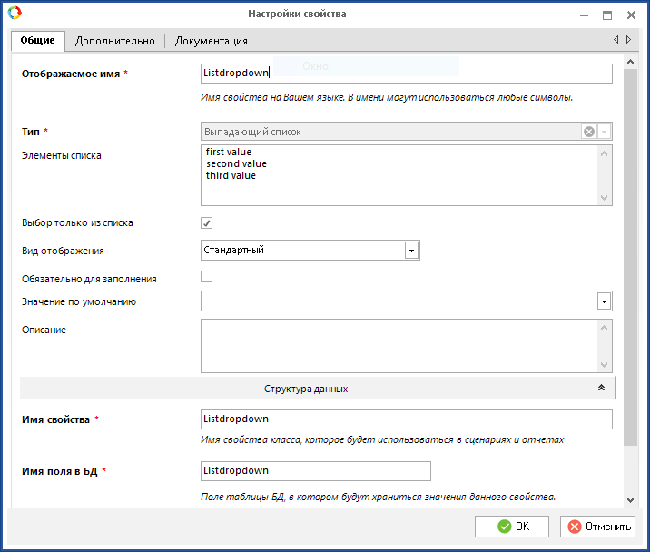
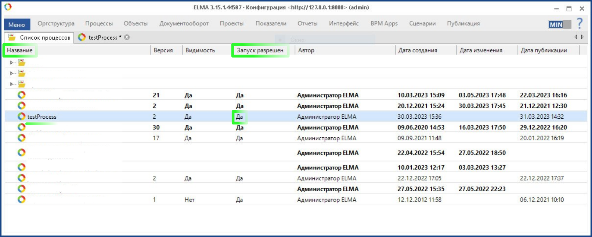
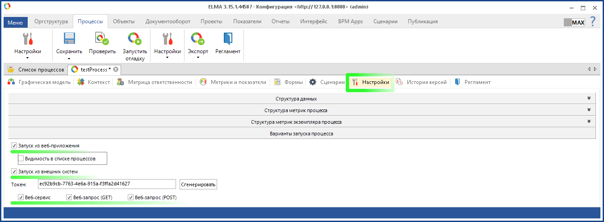
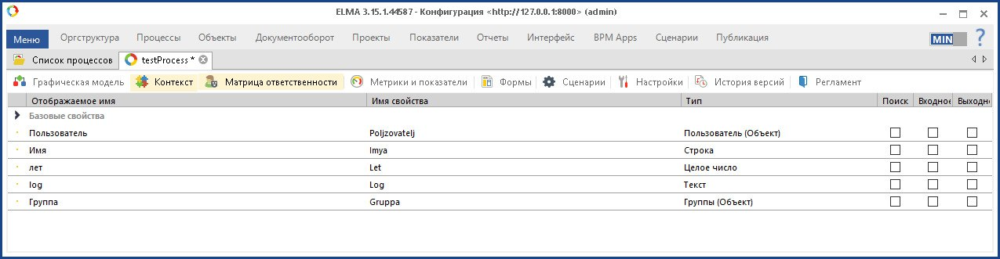
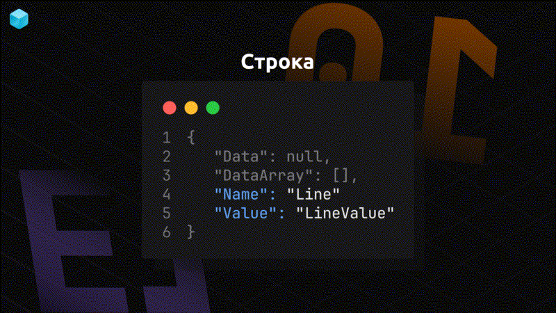

Библиотека решений для работы с сущностями (объекты-справочники) и запуска бизнес процессов Elma.

Код написан на платформе .NET 7.0.102. Имеет зависимости HtmlAgilityPack 1.11.46 и Newtonsoft.Json 13.0.3. Используемая версия Elma 3.15.1.44587

## Авторизация

* * *

Для начала работы с WebAPI ELMA нужно создать экземпляр класса ElmaClient c передачей аргументов token (токен внешнего приложения), hostaddress, username и password,  после нужно вызвать асинхронный метод Build() чтобы подготовить клиент для работы с WebAPI. Обычно используется учетная запись администратора при создании экземпляра.

```C#
var elmaClient = await new ElmaClient(token, hostaddress, username, password).Build();
```

Токен внешнего приложения должен быть заранее сгенерирован в веб-приложении Elma. При создании токена внешнего приложения срок истечения действия токена должен превышать дату когда будет происходить процесс работы с ElmaClient. Также в веб-приложении Elma нужно включить внешнее приложения в котором зарегестрирован используемый токен.

Асинхронный метод `Build()` нужен для получения метаданных от сервера Elma которые в дальнейшем будут использоваться для работы с экземпляром клиента. Данный метод используется для: получения первичной пары AuthToken и SessionToken которые нужны для запросов к Сервисам Elma требующих авторизацию, получения всех доступных объектов Elma (сущности и процессы) с которыми можно работать, получение всех перечислений, получение всех бизнес-процессов которые доступны для запуска через WebAPI и т. д.

Для параметра hostaddress можно указать домен или ip адрес ("elma3.yourcompany.org:8000" или "10.0.0.62:8000")


После авторизации через сервис `AuthorizationService` время действия сгенерированного токена `AuthToken` будет составлять 15 минут, после этого времени совершать запросы к серверу Elma с помощью данного токена будет невозможно в следствии этого перед каждым запросом происходит проверка актуальности токенов `AuthToken` и `SessionToken`, если токены уже не актуальны тогда запрашиваются новые токены с помощью асинхронного метода `RefreshToken()` и после этого совершается целевой запрос. При запросе с неактуальным токеном сервер вернет ответ со статусом 400 и сообщением о том что Токен авторизации недействителен (по данному запросу метод `RefreshToken` определяет актуальность токенов).

## Сущности

* * *

### Получение массива сущностей

Для получение массива сущностей определенного типа, отфильтрованные по запросу используйте метод `QueryEntity(string type)` где аргументом передается наименование сущности с учетом регистра букв. После указываются дополнительные параметры выборки сущностей с помощью методов `Select(string value)` `Limit(int value)` `Offset(int value)` `Sort(int value)` `Filter(string value)` `Eql(string value)` и только после этого вызывается метод `Execute()` который и выполнит запрос к серверу Elma. Например для получение всех пользователей Элмы у которых фамилия "Маяковский" и статус учетной записи "Активна".

```C#
var getUsers = await elmaClient.QueryEntity("User").Filter("LastName:Маяковский,Status:Active").Execute();
```

Для фильтрации выборки лучше всего подходит метод `Eql(string value)`\- **Elma Query Language**. Данный метод использует язык запросов к данным в системе Elma который расширяют возможности выборки данных. [Ссылка](https://www.elma-bpm.ru/KB/article-5614.html) на официальную документацию структурированного языка EQL.

```C#
var getUsers = await elmaClient.QueryEntity("User").Eql("LastName LIKE 'Маяковский' AND Status = 'Active'").Execute();
```

В записи " LastName LIKE 'Маяковский' " вместо LIKE можно использовать знак равно. C LIKE часто используются шаблоны иначе данный оператор будет равносилен знаку равно. Шаблоны могут быть следующие % - любое кол-во произвольных символов, _ - один произвольный символ. Например можно найти пользователей у которых фамилия начинается на Маяк... и т. д. тогда после оператора LIKE значение будет следующим 'Маяк%'.

Можно найти пользователей которые родились до 20 июня 1983 года, первых 10 пропустим и получим только следующих 5 пользователей при этом в получаемом результате нам не нужны все поля возвращаемых сущностей типа User а только дата приема на работу (EmployDate), мобильный телефон (MobilePhone), статус (Status) и полное имя (FullName).

```C#
var getUsers = await elmaClient.QueryEntity("User").Eql("BirthDate < DateTime(1983, 7, 20)")
    .Offset(10).Limit(5).Select("EmployDate,MobilePhone,Status,FullName").Execute();
```

При выборки большого массива данных метод `Select(string value)` поможет сократить объем возвращаемых данных от сервера выбирая только те поля которые нужны и соответственно исключая не нужные.

В случаи когда необходимо получить только идентификатор первой найденной сущности можно воспользоваться асинхронным метод GetFirstId(), если нужно вернуть идентификаторы для всех найденных сущностей тогда воспользуйтесь асинхронным методом GetIds(). Если сервер не сможет найти сущности по заданным критериям тогда данные методы вернут null.

```C#
await elmaClient.QueryEntity("User").Eql("BirthDate < DateTime(1983, 7, 20)").GetFirstId(); // -> 421
await elmaClient.QueryEntity("User").Eql("BirthDate < DateTime(1983, 7, 20)").GetIds(); // -> 38, 321, 421, 90
```

### Получение конкретной сущности по идентификатору

Для получение данных о конкретной сущности используется метод `LoadEntity(string type, int id)`, в type указывается тип (класс) сущности в котором находится нужный объект. Получить данные о конкретной сущности можно только знаю его id. Например получим определенного контрагента по его id при этом нам нужно будет только его поля "годовой доход" (AnnnualIncome):

```C#
var getContractorIncome = elmaClient.LoadEntity("Contractor", id: 20).Select("AnnualIncome").Execute();
```

### Получение списка сущностей определенного типа

В случаи если нужно узнать кол-во сущностей определенного типа для этого есть метод `CountEntity(string type)` который в качестве параметра принимает только наименование типа класса сущности. Например чтобы получить кол-во контрагентов:

```C#
var countContractors = await elmaClient.CountEntity("Contractor");
```

### Добавление новой сущности

С помощью метода `InsertEntity(string type)` аргументом передается имя типа класса сущности. Чтобы добавить записи свойств для обновления сущности используются методы которые начинаются на `Item` и после которых указывается тип добавляемых свойств, например для добавления целого числа нужен метод `ItemInteger(string nameItem, long value)`. Когда будут указаны все необходимые поля для новой сущности после вызывается метод асинхронный `Execute()` который выполняет запрос к серверу на внедрение новой сущности, сам метод при успешном внедрении возвращает Id новой сущности которая была внедрена на сервер.

Например создадим новую сущность для справочника Банковский счет (BackAccount) c полями наименование (Name) - строка, номер счета (AccountNumber) - строка, валюта (Currency) - это ссылочный тип, содержит id сущности которая находится в другом справочнике Currency, статус (AccountStatus) - это перечисление.

```C#
var newBackAccount = elmaClient.InsertEntity("BackAccount");
newBackAccount.ItemLine("Name", "Счет для Обновления");
newBackAccount.ItemLine("AccountNumber", "400817810099910004312");
newBackAccount.ItemEnum("AccountStatus").SetValue("AccountStatus", "Main");
newBackAccount.ItemObject("Currency").Ref("Currency", 2);
var idNewBackAccount = await newBackAccount.Execute();
```

Все поля которые указываются в методах `Item{Type}()` проверяются на соответствие с полями у конкретного типа сущности для которой создается новая сущность. Т. е. если будет указан не существующие или не правильное поле в первом аргументе метода `Item{Type}()` тогда выбросится исключение с данной информацией и всеми доступными полями типа сущности для которой создается новая сущность. Например если попытаться создать новое поле `CheckAccount` которого нет в тип сущности `BackAccount` тогда исключение будет иметь следующий вид:

```C#
newBackAccount.ItemBoolean("CheckAccount", true);
```

> Unhandled exception. System.Exception: Elma Object "BankAccount", don't have field "CheckAccount".Available fields: Id, TypeUid, Uid, Name, BankDetails, AccountNumber, Currency, AccountStatus, Comment.

### Обновление/Изменение сущности

Для обновление данных в конкретной сущности на сервере Elma используется метод `UpdateEntity(string type, int id)` первым параметром передается имя уникального идентификатора типа сущности, вторым уникальный идентификатор сущности. Например у определенной сущности проект `ProjectWork` изменим поля: дата завершения проекта `FinishDate` (тип: Дата/Время), Статус `Status` (тип: Статус проекта (перечисление)) со значение Завершен Closed и изменим поле с Автором Изменения `ChangeAuthor` (тип Пользователь (Объект)). Асинхронный метод `Execute()` внедрит новые изменения в существующий объект и вернет id изменяемой сущности.

```C#
var changeProject = elmaClient.UpdateEntity("ProjectWork", id: 7);
changeProject.ItemDateOnly("FinihsDate", new DateOnly(2023, 3, 16);
changeProject.ItemEnum("Status").SetValue("ProjectStatus", "Closed");
changeProject.ItemObject("ChangeAuthor").Ref("User", 92);
var changedProject = await changeProject.Execute();
```

При работе с объектами Elma класса `WebData` их следует воспринимать как запись в базе данных а класс `WebItem` как поле (атрибут, колонка) определенной записи. Структуру класса `WebItem` при работе хранении примитивных типов данных можно смело представлять как запись в базе данных но когда приходится работать с `WebItem` где значения представлено в виде ссылки на другую сущность в другом типе сущности тогда структура у данной записи будут представлены уже в виде `WebData` где соответсвенно будет определенный набор `WebItem` с помощью которых можно будет найти эту сущность в ссылаемом типе сущности или возможен массив ссылок на сущности в другой таблицы.

### Создание свойства (WebItem) - Целое число

Для создание свойства типа `integer64` используется метод `ItemInteger(string nameItem, long value)` где первым аргументом передается имя создаваемого свойства, втором значение с типом `long`. Например создадим объект типа `Product` где определено свойства `QuantityGoods` типа `Integer64` которое определяет кол-во товара.

```C#
var sonyProduct = elmaClient.InsertEntity("Product");
sonyProduct.ItemLine("Title", "Plyastations");
sonyProduct.ItemInteger("QuantityGoods", 9832);
var idNewSonyProduct = await soneyProduct.Execute();
```

Если свойство типа `integer64` при создании в дизайнере Elma предусматривал пустое значение тогда можно для данного свойства указать значение `null` через метод `ItemSetNull(string nameItem)` первым аргументом передается имя создаваемого свойства (`WebItem`). Например удалим значение свойства `QuantityGoods` для объекта который был создан ранее через обновление сущности `UpdateEntity()`.

```C#
var updateProduct = elmaClient.UpdateEntity("Product", id: idNewSonyProduct);
updateProduct.ItemSetNull("QuantityGoods");
await updateProduct.Execute();
```

### Создание свойства (WebItem) - Дробное число

C помощью метода `ItemDouble(string nameItem, double value)` можно создать `WebItem` с типом данных `Float64`. Точность данного типа ограничена только двумя цифрами после запятой. Т. е. если передать значение 22,999 то сервер Elma преобразует его в следующее значение 23, но если передать значение 22,99 тогда сервер Elma не будет его преобразовывать и оставить изначальное значение которое было отправлено.

```C#
var newEntity = elmaClient.InsertEntity("SomeObject");
elmaClient.ItemDouble("FloatTitle", 89.12); // -> 89,12
elmaClient.ItemDouble("FloatTitle", 89.996); // -> 90
elmaClient.ItemDouble("FloatTitle", 89.129); // -> 89.13
elmaClient.ItemDouble("FloatTitle", 89.1239); // -> 89.12
var idNewEntity = await newEntity.Execute();
```

В случаи если при создании свойства типа `Float64` в дизайнере Elma было определено что данное свойство может иметь пустое значение т. е. `null` тогда при помощи метода `ItemSetNull(string nameItem)` где первым аргументом передается имя свойства можно указать значение `null` для данного свойства.

```C#
var updateEntity = elmaClient.UpdateEntity("SomeObject", id: idNewEntity);
updateEntity.ItemSetNull("FloatTitle");
await updateEntity.Execute();
```

### Создание свойства (WebItem) - Деньги

Свойство `WebItem` типа денег не может иметь пустое значение т. е. использовать null с данными `WebItem` не возможно (в дизайнере Elma при создании свойства типа Денег нет настройки допускающей что поле может принимать пустое значение в отличии от свойств типа дробного число). Но если передать значение для свойства типа Деньги пустую строку "", тогда сервер преобразует для данного свойства `WebItem` типа деньги значение `null`. В случаи если передавать значение `null` напрямую в значение `WebItem` тогда сервер не произведет никаких изменения со свойством и тем самым оставит прежнее значение которые находилось в данном свойстве. Если все же требуется указать для свойства типа деньги пустое значение т. е. `null` тогда нужно вызвать метод `ItemMoneySetNull(string nameItem)`. **Во всех остальном данный тип идентичен типу `Float64` дробное число**.

```C#
var updateSomething = elmaClient.UpdateEntity("SomeObject", id: 322);
updateSomething.ItemMoney("MoneyFieldName", 34.23);
await updateSomething.Execute();
```

```C#
updateSomething.ItemMoneySetNull("MoneyFieldName");
```

### Создание свойства (WebItem) - Да/Нет Boolean

Для создание свойства типа `boolean` используется метод `ItemBoolean(string nameItem, bool value)` где `nameItem` \- имя свойства в объекте, `value` \- `boolean` значение. Например изменим свойство `isGraduation` для какого-нибудь объекта типа `Student` идентифицирующее что студент закончил обучение.

```C#
var updateStudent = elmaClient.UpdateEntity("Student", id: 32);
updateStudent.ItemBoolean("isGraduation", true);
await updateStudent.Execute();
```

Если при создании данного свойства в дизайнере Elma было настроено что свойство может иметь пустое значение, тогда можно воспользоваться метод `ItemSetNull()` чтобы присвоить пустое значение для свойства типа boolean.

```C#
updateStudent.ItemSetNull("isGraduation");
```

Создание свойств (WebItem) типа - Строка, Текст, Html-Разметка, Выпадающий список

Для свойств типа текст и html-разметка применяется один метод `ItemText(string nameItem, string value)`. Для данных свойств (строка, текст, Html-разметка, выпадающий список) можно по умолчанию присвоить пустое значение т. е. `null` через метод `ItemSetNull(string nameItem)`. Для свойств типа строка и выпадающий список применяется метод `ItemLine(string nameItem, string value)` где для параметра value перед созданием WebItem происходит проверка на то что передаваемое значение представлено только одной строкой, иначе будет выброшено исключение.

> Unhandled exception. System.Exception: For WebItem with type Line there should be only one Line of text. Value: &lt;YourPassedValueHere&gt;

Значение в типе выпадающий список представлено обычным типом string. Даже при условии того что при создании свойства типа выпадающий список данное свойство было настроено на выбор значение только из выпадающего списка можно передать совершенно иное значение отличное от тех что содержаться в данном списке. Например в момент создание свойства типа выпадающий список были определены следующие значения: first value, second value, third value. И при условии того что выбор возможен только из представленных значений.



Передадим отличное значение от тех что содержаться в данном списке для какого-нибудь объекта.

```C#
var updateUser = elmaClient.UpdateEntity("CustomUser", id: 50);
updateUser.ItemLine("Listdropdown", "another value");
await updateUser.Execute();
```

Данный код будет работать, сервер Elma обработает данный запрос и подставит для данного свойства значения которого нет в списке.

### Создание свойства (WebItem) - Url

Чтобы создать свойство типа `Url` нужен метод `ItemUrl(string nameItem, Uri url)` где `nameItem` \- имя свойства в объекте с типом `url`, `url` \- передаваемое на сервер значение типа `Uri`. Например укажем значение для свойства `scheduleUrlWeek` (`url` путь до ресурса с информацией о еженедельном расписании) для какого-нибудь объекта типа `Group`.

```C#
var updateGroup = elmaClient.UpdateEntity("Group", id: 31);
updateGroup.ItemUrl("scheduleUrlWeek", new Uri("https://university.com/scheduleGroup/321/currentWeek"));
await updateGroup.Execute();
```

Чтобы очистить поле используется метод `ItemSetNull(string nameItem)`.

### Создание свойства (WebItem) - Временной интервал

Чтобы создать свойство `WebItem` типа временной интервал нужен метод `ItemTimeInterval(string nameItem, TimeInterval timeInterval)` где `nameItem` \- имя свойства, `timeInterval` экземпляр класса `TimeInterval` в конструктор которого можно передать дни, часы и минуты (секунды не указываются). Например обновим свойство типа временной интервал для какого-нибудь объекта со значение 5 дней 3 часа 59 минут.

```C#
var updateObject = elmaClient.UpdateEntity("NameObject", id: 892);
updateObject.ItemTimeInterval("NameFiledTimeInterval", new TimeInterval(days: 5, hours: 3, minutes: 59));
await updateObject.Execute();
```

Параметр `hours` конструкторы класса `TimeInterval` может принять только целочисленное значение в диапазоне от 0 до 23 (включительно), если будет передано иное значение будет выброшено исключение. Параметр `minutes` также принимает целочисленное значение в диапазоне от 0 до 59 (включительно), если будет передано иное значение также будет выброшено исключение.

Каждый из параметров конструктора класса TimeInterval можно опустить и передавать исключительно только те параметры которые нужны. Например если нужно указать только дни/минуты, часы/минуты, дни/часы.

```C#
new TimeInterval(days: 11, minutes: 59);
new TimeInterval(hours: 16, minutes: 10);
new TimeInterval(days: 3, hours: 20);
```

Можно для свойств типа временной интервал присвоить пустое значение т.е. `null`, при условии что данное свойство в момент его создание в дизайнере Elma было настроено с возможность принимать значение `null`.

```C#
updateObject.ItemSetNull("NameFiledTimeInterval");
```

### Создание свойства (WebItem) - Дата

Создать WebItem с типом даты можно с помощью метода `ItemDateOnly(string name, DateOnly dateOnly)` где первым аргументом передается имя свойства в объекте Elma, вторым экземпляр класса `DateOnly`. Например добавим новую сущность типа `Student` где будет свойство `WebItem` `EnrolledDate` (т. е. дата зачисления) в котором укажем дату автоматически из операционной системы.

```C#
var newStudent = elmaClient.InsertEntity("Student");
newStudent.ItemDateOnly("EnrolledDate", DateOnly.FromDateTime(DateTime.Now));
var idNewStudent = await newStudent.Execute();
```

Если требуется указать конкретную дату в свойстве тогда нужно вторым аргументом передать экземпляр класса `DateOnly(int year, int month, int day)`. Например у этого же студента укажем в свойстве `GraduationDate` дату окончание учебы.

```C#
var updateStudent = elmaClient.UpdateEntity("Student", id: idNewStudent);
updateStudent.ItemDateOnly("GraduationDate", new DateOnly(2023, 07, 15);
await updateStudetn.Execute();
```

Чтобы убрать значение в определенном свойстве типа "Дата" нужно вызвать метод `ItemSetNull(string name)` где первым аргументом передается имя свойства `WebItem` с типом дата. Например уберем в свойстве `WebItem` `GraduationDate` значение (только при условии что данное свойство допускает значение null).

```C#
var updateStudent = elmaClient.UpdateEntity("Student", id: idNewStudent);
updateStudent.ItemSetNull("GraduationDate");
await updateStudent.Execute();
```

### Создание свойства (WebItem) - Дата/Время

Для создание свойства `WebItem` с типом данных Дата/Время используется метод `ItemDateTime(string nameItem, DateTime dateTime)` где первым аргументом передается имя свойства (`WebItem`) с типом данных Дата/Время, вторым аргументом передается экземпляр класса `DateTime`. Можно указать значение Дата/Время автоматически из операционной системы c помощью `DateTime.Now` или напрямую передавая аргументы при создании экземпляра класса `DateTime(int year, int month, int day, int hour, int minute, int second)`. Например давайте укажем для свойства типа Дата/Время значение которое должно быть на 10 дней и 3 часа больше чем значение Дата/Время определяемое автоматически из операционной системы.

```C#
var updateSomething = elmaClient.UpdateEntity("SomethingObject", id: 32);
updateSomething.ItemDateTime("DateTimeTitle", DateTime.Now.AddDays(10).AddHours(3));
await updateSomething.Execute();
```

Секунды в данном типе данных указать нельзя (точность только до минут). Чтобы указать конкретную дату и время нужно передать экземпляр класса DateTime() аргументы в конструкторе которого определяет значения для нашего типа. Например укажем для какого-то свойства 15 января 2024 года 21 час 43 минуты.

```C#
updateSomething.ItemDateTime("DateTimeTitle", new DateTime(2024, 1, 15, 21, 43));
```

Чтобы удалить значение свойства типа Дата/Время при условии что данное свойство может иметь пустое значение используется метод `ItemSetNull(string nameItem)` где аргументом передается имя свойства (`WebItem`).

```C#
updateSomething.ItemSetNull("DateTimeTitle");
```

### Создание свойства (WebItem) - Перечисление / Enum

Для создание свойства типа Enum используется следующая конструкция, сначала вызывается метод `ItemEnum(string nameItem)` где аргументом передается имя создаваемого свойства, далее вызывается метод `SetValue(string nameEnum, string valueEnum)` который определяет значение перечисления. Представим что есть перечисления представляющая Пол `Pol` со следующими константами данного перечисления: Женский `Zhenskiy`, Мужской `Muzhskoy`, тогда для того чтобы создать `WebItem` представляющее тип Enum `Pol` со значение Мужской нужен следующий код:

```C#
var updateObject = elmaClient.UpdateEntity("SomeObject", id: 32)
updateObject.ItemEnum("TitleEnum").SetValue("Pol", "Muzhskoy");
await updateObject.Execute();
```

При условии что в процессе создания свойства типа Enum в дизайнере Elma было определено что данное свойство может иметь пустое значение тогда для того что присвоить пустое значение т.е. null нужно вызвать метод `SetNull()`.

```C#
updateObject.ItemEnum("Pol").SetNull();
```

Когда создается поле (WebItem) типом значения которого является перечисление тогда под капотом используется метод `GetEnumValue(string enum, string value)` где первым аргументом указывается имя перечисления, вторым имя константы этого перечисления. Данный метод возвращает индекс константы в конкретном перечислении. При создании WebItem где значением представлено перечисления то значение которое уже передается серверу будет целочисленное типа, т.е. запись `elmaClient.getEnumValue("AccountStatus", "Main")` и запись `newBackAccount.ItemInteger("AccountStatus", 0)` будут идентичны. Метод `GetEnumValue(string enum, string value)` всего лишь является синтаксически сахаром который по имени перечисления и именованной константы возвращает целочисленной значение. Помимо этого у данного метода есть дополнительные проверки на существование конкретного перечисления и конкретной именованной константы, если не будет найдено перечисление или именованная константа тогда выбросится исключение.  Например если попытаться получить целочисленной значение в каком-нибудь не существующем Перечислении и второй вариант если попытаться получить целочисленной значение какой-нибудь несущствующей именованной константы в существующем перечислении тогда исключения будут следующего вида:

```C#
elmaClient.GetEnumValue("NonExistentEnum", "NameConstant");
```

> Unhandled exception. System.Exception: Enum with name: 'NonExistentEnum' isn't existed in storage

```C#
elmaClient.GetEnumValue("ExistentEnum", "NonExistentNameConstant");
```

> Unhandled exception. System.Exception: The enum 'ExistentEnum' doesn't have value 'NonExistentNameConstant'

Также будет выброшено исключение в случаи если в существующем перечислении нет ни одной именованной константы т.е. пустой перечисление.

> Unhandled exception. System.Exception: The enum 'ExistentEnum' doesn't have any values

### Создание свойства (WebItem) - Ссылка на другой объект

Для того чтобы создать `WebItem` который будет представлять ссылку на другой объект в системе Elma используется следующие методы. Сначала через методы `UpdateEntity()` или `InsertEntity()` определяться внедрение или обновление сущности. Далее методом `ItemObject(string nameObject)` определяется название `WebItem` и уже после с помощью асинхронного метода `Ref(string nameObject, long id)` указывается ссылка на объект Elma.

```C#
var updateStudentGroup = elmaClient.UpdateEntity("Student", id: 742);
// var insertNewStudet = elmaClient.InsertEntity("Student"); 
// или внедрение новой сущности с полем ссылкой на другой объект Elma
await updateStudentGroup.ItemObject("MainGroup").Ref("Group", 234);
```

В методе `Ref(string nameObject, long id)` происходит две проверки:

1.  Есть ли объекты типа на сервере Elma с именем передаваемым первым аргументом `nameObject`;
2.  Существует ли сущность в объектах типа `nameObeject` с идентификатором который передается вторым аргументом `id`.

Если одно из условий будет ложным код выбросит исключение с информацией что конкретно указано не правильно имя типа объекта или уникальный идентификатор.

В случаи если нужно указать что WebItem не ссылается ни на одну сущность тогда нужно вызвать метод `SetNull()`.

```C#
updateStudentGroup.ItemObject("GroupMain").SetNull();
```

После определение всех Items нужно вызвать асинхронный метод `Execute()` который выполнит запрос на сервер и внесет изменения.

```C#
await updateUserGroup.Execute();
```

Выше изложенные цепочки вызовов функций применимы для обновление сущностей на сервере или внедрение уже новых сущностей. Если при внедерении новой сущности у которой есть WebItem представляющий ссылку на объект Elma и который должен быть пустым (т.е. не должен ссылаться ни на какие-либо объекты) тогда вызывать метод SetNull() не требуется, по умолчанию для такого `WebItem` будет значение null.

### Создание свойства (WebItem) - Массив ссылок на другие объекты

Для создание `WebItem` зависимости с определенным набором объектов на которые будет ссылаться создаваемый `WebItem` используется следующая методы. Например добавим студентов для группы.

```C#
var updateGroup = elmaClient.UpdateEntity("Group", id: 834);

await updateGroup.ItemObjects("Students").Ref("Student", 4843, 3434, 4311, 4834);
// можно передать вторым аргументом массив элементов типа long
await updateGroup.ItemObjects("Students").Ref("Student", new long[] { 4843, 3434, 4311, 4834 });

await updateGroup.Execute(); // обязательно! иначе изменения не будут отправлены на сервер
```

Сначала определяется внедрение новой сущности через метод `InsertEntity()` или обновление уже существующего объекта через метод `UpdateEntity()`. Далее если требуется определить полностью новый `WebItem` с ссылками на объекты Elma то нужно воспользоваться асинхронным методом `Ref(string nameObject, param long[] ids)`. В данном методе будет проведены такие же проверки как и в методе `Ref(string nameObject, long id)` при создании `WebItem` ссылающейся на один объект Elma. Т. е. проверки на существование объекта Elma с именем передаваемым первым аргументом `nameObject` и существование объектов в данном типе с идентификатороми передаваемыми вторым аргументом.

Если на сервере Elma для изменяемой сущности уже были какие-либо ссылки на объекты в `WebItem` `Students` то они будут полностью перезаписаны новыми ссылками которые будут передаваться вторым аргументом асинхронного метода `Ref()`. Если требуется в изменяемой сущности удалить для WebItem ссылки на объекты  (т. е. полностью очистить `WebItem` от зависимостей) тогда нужно воспользоваться методом `SetEmpty()`. Например можно удалить все ссылки на объекты типа `Student` у группы:

```C#
updateGroup.ItemObjects("Students").SetEmpty();
```

В случаи создание новой сущности где должно уже быть проинициализировано значение для `WebItem` с массивом объектов зависимостей применяется тот же подход что и при изменении `WebItem` с массивом зависимостей. Например создадим новую сущность типа `Group` где будет `WebItem` `Students` с массивом ссылок на объекты зависимости типа `Student`.

```C#
var newGroup = elmaClient.InsertEntity("Group");
newGroup.WebItem("Name", "АаБб-20Сс");
await newGroup.ItemObjects("Students").Ref("Student", new long[] {3222, 2321, 4342, 1221, 2358 });
var idNewGroup = await newGroup.Execute();
```

Если требуется только добавить новые ссылки на объекты для `WebItem` где уже есть ссылки на объекты и они не должны быть перезаписаны тогда нужно воспользоваться асинхронным методом `Add(string nameObject, params long[] ids)`, где первым аргументом передается имя типа объекта Elma а вторым идентификаторы сущностей в данном типе объекта. Также будет проведена проверка на существование типа объекта с именем который передается первым аргументом и проверка на существование объектов с идентификаторами передаваемыми вторым аргументом. Например добавим еще студентов `Student` для какого-нибудь объекта `Group` где уже имеются определенное кол-во студентов в `WebItem` `Students`.

```C#
var updateGroup = elmaClient.UpdateEntity("Group", id: 834);

await updateGroup.ItemObjects("Students").Add("Student", 4840, 4841, 4842, 4843, 4843, 4843, 4843);
// можно передать вторым аргументом массив элементов типа long
await updateGroup.ItemObjects("Students").Add("Student", new long[] { 4840, 4841, 4842, 4843, 4843, 4843, 4843 });

await testingObject.Execute();
```

При передачи вторым аргументов повторяющихся идентификаторов даже тех что уже были ранее определены в `WebItem` `Students` обновляемого объекта, будет проводиться проверка всех данных идентификаторов на уникальность в списке где они расположены. Т. е. нельзя добавить несколько ссылок на один и тот же объект `Student`. Допусти уже были определены в `WebItem` `Studetns` два объекта `Student` c идентификаторами 4383, 4387 тогда `WebItem` `Students` после изменения будет содержать следующие объекты `Student` с идентификаторами 4383, 4387, 4840, 4841, 4842, 4843.

Если требуется удалить определенные объекты (ссылки) в свойстве при этом остальные объекты должны остаться в свойстве используется асинхронный метод `Remove(string nameObject, params long[] ids)`. Например у определенной группы `Group` удалить тех студентов которых отчислили.

```C#
var group = elmaClient.Update("Gruppy", id: 324);
await group.ItemObjects("Students").Remove("Student", 854, 2341, 213, 392); // OR > new long[] { ... }
await group.Execute();
```

В методе Remove проходят все те же проверки на существование типа сущности и существование экземпляров данного типа с передаваемыми идентификаторами.

### Создание свойства (WebItem) - Блок

Для того чтобы создать `WebItem` типа блок нужен метод `ItemBlock(string nameItem)` где `nameItem` \- это имя свойства где определен `WebItem` типа блок. После есть два возможных варианта добавления значения для данного свойства: 1\. Через метод `Ref(params MakeWebData[] webDatas)` где в аргументе передается массив новых "записей" которые полностью перезапишут все ранее сохраненные данные (если они были) типа `WebData` в значении массива `DataArray` данного свойства. 2\. Добавление новых "записей" типа `WebData` в массив `DataArray` свойства типа блок через асинхронный метод `Add(params MakeWebData[])` при этом "записи" которые ранее уже были определены в значении массива `DataArray` свойства типа блок перезаписаны не будут.

Для создание "записей" для массива значений `DataArray` в свойстве типа блок нужно предварительно их создать через метод `MakeWebData()` прежде чем добавить в тело запроса. Далее вызываются методы которые конфигурируют данные WebData ("запись") которая в дальнейшем передается в методы `Ref()` или `Add()`.

Например создадим новую сущность типа `Group` где будет свойство `StudentsBlock` типа блок который в свою очередь будет иметь следующую схему: `UniqueIdMember` типа `integer`, `Student` типа объект `Student` и `AverageScore` типа `integer`.

```C#
var newGroup = elmaClient.InsertEntity("Group");

var studOne = elmaClient.MakeWebData();
studOne.ItemInteger("UniqueIdMemeber", 11);
studOne.ItemDouble("AverageScore", 3.74);
studOne.ItemObject("Student", 472);

var studTwo = elmaClient.MakeWebData();
studTwo.ItemInteger("UniqueIdMember", 23);
studTwo.ItemDouble("AverageScore", 4.29);
studTwo.ItemObject("Student", 832);

newGroup.ItemBlock("StudentsBlock").Ref(studOne, studTwo);

await newGroup.Execute();
```

В случаи если нужно добавить новые данные ("записи") в свойстве блок в уже созданной сущности которая находится на сервере используется метод `Add()`. Например добавим новые записи для свойства `StudentsBlock` для какой-нибудь сущности типа `Group`.

```C#
var updateGroup = elmaClient.UpdateEntity("Group", id: 92);

var newRecordBlock = elmaClient.MakeWebData();
newRecordBlock.ItemInteger("UniqueIdMember", 34);
newRecordBlock.ItemDouble("AverageScore", 3.11);
newRecordBlock.ItemObject("Student", 753);

await updateGroup.ItemBlock("StudentsBlock").Add(newRecordBlock);

await updateGroup.Execute();
```

Очистить записи в свойстве типа блок нет возможности. Даже при условии передачи пустого массива представляющего значение для изменения свойства типа блок сервер Elma не произведет никаких изменений.`WebItem` `{"Items":[{"Data":null,"DataArray":[],"Name":"StudentsBlock",Value:null}],"Value":null}` при таком запросе на изменения ничего не будет.

## Бизнес-процессы

* * *

### Запуск бизнес-процесса по наименованию

Для того чтобы инициировать запуск процесса по его наименованию используется метод метод `StartProcess(string nameProcess)` где аргументом передается уникальное наименование бизнес-процесса которые было назначено при создании бизнес-процесса в общих свойствах. Чтобы ознакомится со всеми доступными бизнес-процессами и их наименованиями нужно в дизайнере Elma пройти во вкладку Процессы -> Список процессов.



**Каждое наименование бизнес-процесса уникально т. е. нельзя создать два процесса с одинаковыми названиями.**

Запускаемый процесс должен быть настроен на запуск из внешних систем иначе еще на этапе вызова метода `StartProcess()` код выбросит исключение информирующее о том что он не может найти данный процесс в списке процессов доступных для запуска, и также после будет указан список всех доступных бизнес-процессов для запуска. Например если указать не существующий бизнес-процесс или не доступный для запуска бизнес-процесс в аргументе метода `StartProcess` тогда исключение будет следующим:

> Unhandled exception. System.Exception: Process "YOUR_PROCESS" isn't found. Alll available process:> processOne, processTwo, processThree e.t.

Для настройки бизнес-процесса который будет запускаться через внешнее приложение нужно установить галочки для следующих пунктов: запуск из веб-приложения, запуск из внешних систем через веб-сервис, веб-запрос (GET) и веб-запрос (POST).



Например запустим бизнес процесс `testProcess` графическая модель (карта) которого состоит только из одного элемента BPMN "Сценарий" т. е. после запуска данного процесса будет исполнен сценарий который был определен в дизайнере и после экземпляр бизнес-процесса закончит свое выполнение. Помимо всего прочего также в контексте данного бизнес-процесса были определены свойства которые нужны в элементе "Сценарий".



```C#
var instanceProcess = elmaClient.StartProcess("testProcess");

// определение значений контекста процесса
instanceProcess.ItemText("Log", "something in the logging");
instanceProcess.ItemInteger("Let", 2);
instanceProcess.ItemLine("Imya", "Vladimir");
await instanceProcess.ItemObject("Group").Ref("Group", 824);

// для отправки http запроса команды запуска процесса с определенным контекстом 
// на сервер Elma в конце используется асинхронный метод Execute()
// сервер при успешном запуске бизнес-процесса вернет 
// WebItem с именем Result и значение True
var result = await instanceProcess.Execute();
var isSuccessful = result!.Items.First(item => item.Name == "Result").Value == "True";
```

При создании контекста процесса происходят все те же проверки на существование свойств в данном контексте что и при создании свойств сущностей Elma. Для ознакомления с результатом работы экземпляра бизнес-процесса `testProcess` можно пройти в веб-приложение Elma в раздел "Процессы".

Подобный способ запуска бизнес-процессов очень удобен в случаи если необходимо удалить определенные сущности (объекты-справочники) т. к. сервис `IEntityService` по работе с сущностями Elma предоставляет функционал только для создания, обновления и чтения сущностей. Это реализуется следующим способом:

1.  С помощью сервиса `IEntityService` и его функционала обновление сущностей отмечаются уникальным идентификатором те сущности которые должны быть удалены.
2.  Создается бизнес процесс только с одним элементом-сценарием. В котором по определенному уникальному идентификатору будет осуществляться поиск сущностей которые должны быть удалены.
3.  Запускается код которые сначала отмечает сущности идентификатором и после отправляет серверу Elma команду на запуск бизнес-процесса которые удалит данные помеченные сущности.

Например удалим сущности типа `Group` группы у которых нет студентов т. е. ни одна из сущностей типа `Student` не ссылается на определенную группу `Group`:

- *Код сценария в дизайнере Elma*

```C#
public virtual void deleteGroups(Context context)
{
    var findGroupsWithoutStuds = PublicAPI.Objects.UserObjects.UserGruppy.Filter().Naimenovanie(context.Identifier).Find();
    // pass context's property value about how many were deleted
    context.HowManyDeleted = findGroupsWithoutStuds.Count();
    
    // delete groups 
    foreach (var group in findGroupsWithoutStuds)
        group.Delete();
}
```

- Основной код консольного приложения на платформе .NET

```C#
var Identifier = "Delete_For_No_Students";

var groups = await elmaClient.QueryEntity("Gruppy").Select("Naimenovanie").Execute();
var idsGroups = groups!.Select(group => long.Parse(group.Items.First(item => item.Name == "Id").Value)).ToList();

var idsGroupsWithoutStuds = new List<long>();

// find all groups without students
foreach (var idGroup in idsGroups)
{
    var studsGroup = await elmaClient.QueryEntity("Studenty").Eql("Gruppa = " + idGroup).Execute();
    
    if (studsGroup!.Count() == 0) idsGroupsWithoutStuds.Add(idGroup);
}

// update groups without students with marker about it
foreach (var idGroup in idsGroupsWithoutStuds)
{
    var updateGroup = elmaClient.UpdateEntity("Gruppy", id: idGroup);
    updateGroup.ItemLine("Naimenovanie", Identifier); // Marker identifier for delete
    var result = await updateGroup.Execute();
}

// launch deletion process
var deleteGroupProcess = elmaClient.StartProcess("deleteGroupsWithoutStudents");
// pass unique Marker which need for find Groups without students
deleteGroupProcess.ItemLine("Identifier", Identifier); 

var executeResult = await deleteGroupProcess.Execute();
```

## Подключение библиотеки Elmapi (включая зависимости) к проекту

* * *

Сначала нужно добавить в директорию целевого проекта библиотеку Elmapi.dll которая находится в репозитории проекта *Elmapi/bin/Debug/net7.0/Elmapi.dll*.

В файле .csproj целевого проекта добавить ссылку на библиотеку Elmapi.dll

```xml
<ItemGroup>
    <Reference Include="MyAssembly">
        <HintPath>Elmapi.dll</HintPath>
    </Reference>
</ItemGroup>
```

```
YourProject/
|--- bin/..
|--- obj/..
|--- Elmapi.dll
|--- Program.cs
|--- YourProject.csproj
```

Последним этапом добавляются зависимости в целевой проект которые используются в проекте Elmapi. Чтобы посмотреть зависимости откройте файл Elmapi.csproj.

```xml
<ItemGroup>
    <PackageReference Include="HtmlAgilityPack" Version="1.11.46" />
    <PackageReference Include="Newtonsoft.Json" Version="13.0.3" />
</ItemGroup>
```

## Дополнение+

* * *

### Работа с переменными окружения

В проекте существует файл `Env.cs` предоставляющий возможность получить данные в файле `.env` (или для разных окружений типа .dev, .prod, .staging) в котором можно указать переменные вашего окружения. Чтобы получить доступ доступ к файлам с переменными окружения нужно создать экземпляр класса `EnvModule(string fileName)` и аргументом передать названия файла с переменными окружения. В файле с переменными окружения нужно указать записи "ключ-значение" через знак равно, для каждой строки в файле можно указывать только одну запись. Создадим файл с переменными окружения для сервера Elma, синхронизируем с экземпляром класса EnvModule и получим к ним доступ через метода данного класса.

*Файл .env*

```C#
TOKEN=E233890FAB32928FF328898DAC9807232389CA233290890810932300EAD32321E
HOSTADDR=10.0.0.62:8000
USERNAME=admin
PASSWORD=secretPass!$76$
```

*Program.cs*

```C#
var env = new EnvModule(".env"); // могут быть разные файлы с переменными окружения .dev .prod .staging

var token = env.GetVar("TOKEN");
var hostaddress = env.GetVar("HOSTADDR");
var username = env.GetVar("USERNAME");
var password = env.GetVar("PASSWORD");
```

Метод `GetVar(string key)` возвращает значение переменной окружение в файле с именем которое указывается в аргументе данного файла (важно: регистр букв учитывается при поиске). Далее данные переменные передается при создании экземпляра класса `ElmaClient(string token, string hostaddress, string username, string password)`.

Если в директории где находится файл `Program.cs` не будет файла с именем .env код выбросит исключение информирующее об этом или если при попытке получить переменную окружения через метод `GetVar(string key)` такой переменной не будет или будет указана не правильно тогда также будет исключение.

### Значение возвращаемых типов Elma



### Создание внешнего приложения и токена в веб-приложении Elma


